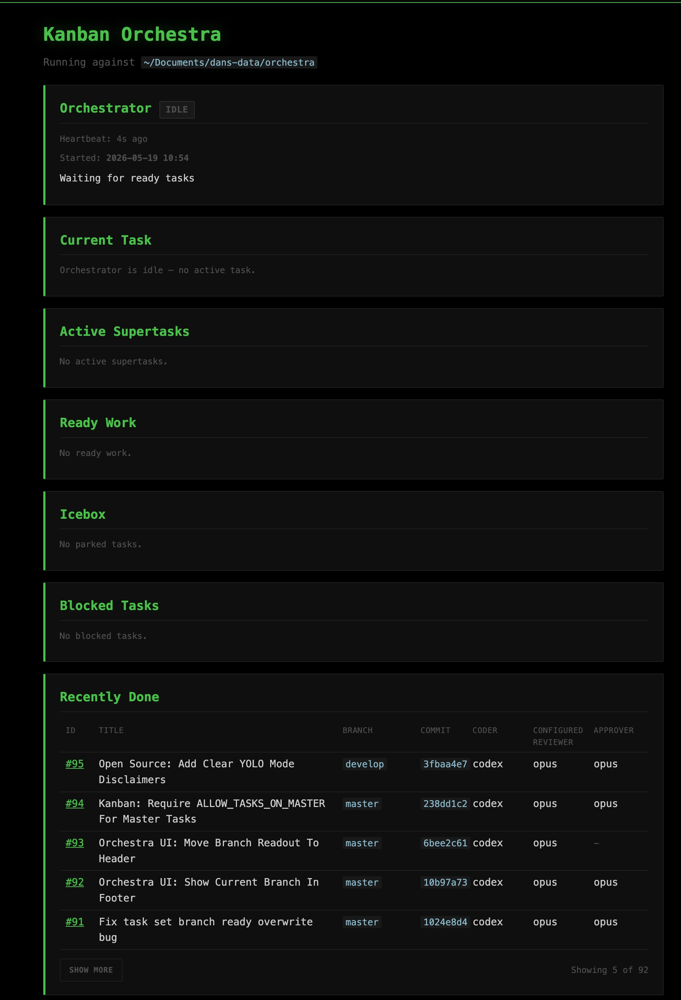
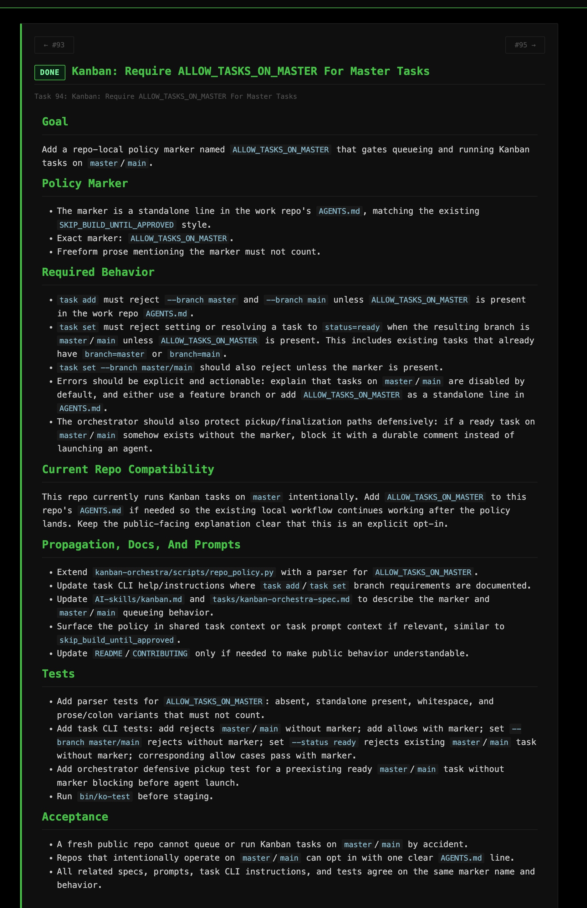

# Orchestra

Orchestra coordinates the AI coding CLIs you already have installed —
[Claude Code](https://claude.ai/code),
[OpenAI Codex CLI](https://github.com/openai/codex),
[Gemini CLI](https://github.com/google-gemini/gemini-cli) —
into an autonomous development team. You describe tasks in plain language;
Orchestra queues them, assigns one CLI to code and another to review, runs
rejection cycles on the staged diffs, and lands approved commits — while you
do something else.

<table>
  <tr>
    <td colspan="2">
      
    </td>
  </tr>
  <tr>
    <td width="50%">
      
    </td>
    <td width="50%">
      
    </td>
  </tr>
</table>

## How It Works

Orchestra is a Python-based local task queue backed by SQLite. Each task is
scoped to one git commit. The orchestrator prompts a coding agent to make the
change, routes the diff through a review agent, and repeats until the reviewer
approves or the retry budget is exhausted. The approved commit is then
finalized on the branch.

The primary interface is your AI agent's **Kanban skill**, not a CLI you drive
by hand. You install the skill into your agent, then talk to it: *"Queue a
task to fix X."* The skill handles bootstrapping, task creation, status
checks, and all wrapper commands.

## Operator Visibility

Everything the orchestrator does is visible. The live dashboard shows active
tasks, ready and blocked queues, recent completions, and the orchestrator's own
heartbeat. Each task carries durable comments — reviewer feedback, validation
results, commit messages — so you can trace every decision without reading
agent logs. Run logs capture the full session, and control commands let you
pause, resume, or inspect any task from another terminal or a remote agent
session. If something stalls or fails, you see it immediately and can
intervene.

## Supported Agents

Orchestra shells out to local agent CLIs. It ships with built-in support for:

| Key | Agent CLI | Notes |
|-----|-----------|-------|
| `claude` / `sonnet` / `haiku` / `opus` | [Claude Code](https://claude.ai/code) | Default coder and reviewer |
| `codex` | [OpenAI Codex CLI](https://github.com/openai/codex) | |
| `gemini` | [Gemini CLI](https://github.com/google-gemini/gemini-cli) | |
| `kilo` | [Kilo Code](https://kilocode.ai) | |

You can add or change agent commands in
`shared_scripts/shared_config.py`. Orchestra does not provide API keys,
accounts, or billing — install and authenticate each CLI yourself.

## Prerequisites

- **Python 3.10+**
- **Git**
- **macOS or Linux** (Windows is untested)
- At least one supported agent CLI installed and authenticated

## Getting Started

1. **Clone the repo:**

   ```bash
   git clone https://github.com/confusionstudios/orchestra.git /path/to/orchestra
   ```

2. **Set `ORCHESTRA_DIR`** in your shell startup file (`.zshrc`, `.bashrc`, or
   equivalent):

   ```bash
   export ORCHESTRA_DIR="/path/to/orchestra"
   ```

3. **Bootstrap the Python environment:**

   ```bash
   "$ORCHESTRA_DIR/shared_scripts/bootstrap-python-env.sh"
   ```

4. **Sync skills into a work repo:**

   ```bash
   cd /path/to/work-repo
   "$ORCHESTRA_DIR/bin/ko-sync-skills"
   ```

5. **Start the dashboard** for the work repo:

   ```bash
   "$ORCHESTRA_DIR/bin/ko-ui"
   ```

   Use the Browser button in `orchestra-ui` to open the HTML dashboard.

6. **Talk to your agent.** In the work repo, invoke the Kanban skill with a
   plain-language request:

   > "Using the Kanban skill, queue a task to fix the broken pagination query."

   The skill handles the rest.

### Remote Control

The orchestrator runs continuously on your machine, polling for tasks and
dispatching local agents to do the work. You don't need to be at the terminal
to queue tasks. Use
[Claude Code Remote Control](https://docs.anthropic.com/en/docs/claude-code/remote-control),
[OpenAI Codex](https://chatgpt.com/codex) from the ChatGPT app, or any agent
channel that reaches your machine — Discord bots, Telegram, whatever you wire
up. Say *"queue a task to refactor the auth middleware"* from your phone, and
the orchestrator picks it up.

From there, everything happens locally: agents write the code, other agents
review the diff, rejections loop back for another attempt, and approved commits
land on the branch — all while you're away from your desk.

### Hardening

Agent commands run as your local user with no sandbox. Always run
Orchestra under a **separate macOS user account**, an OrbStack/Docker
container, or a `sandbox-exec` profile. A prompt-injected or
misbehaving agent can read, modify, or exfiltrate anything your user
account can access — credentials, SSH keys, other repos, browser
state. See [SECURITY.md](SECURITY.md) for the full threat model.

### Tips

* Orchestra will not launch against a dirty worktree. Commit or stash before
  starting.
* The agent running the Kanban skill should not modify the worktree itself —
  queued runs block if uncommitted changes appear between tasks.
* Set a task to `none` status while you're still editing it. Change it to
  `ready` when it should be picked up.
* The Kanban skill can adjust task details before launch: add/remove skipped
  steps, swap the coding or review agent, change retry limits. Ask it.

## Agent Configuration

Default agent roles can be overridden with environment variables. Set each one
to a key from `shared_scripts/shared_config.py`:

```bash
export ORCHESTRA_DEFAULT_CODER=haiku
export ORCHESTRA_DEFAULT_REVIEWER=codex
export ORCHESTRA_DEFAULT_PLANNER=sonnet
export ORCHESTRA_DEFAULT_PLAN_REVIEWER=codex
export ORCHESTRA_DEFAULT_SUPER_PLANNER=sonnet
export ORCHESTRA_DEFAULT_SUPER_REVIEWER=codex
```

## Source Layout

| Path | Contents |
|------|----------|
| `AI-skills/` | Canonical skill instructions — `bin/ko-sync-skills` copies these into each agent's config directory |
| `kanban-orchestra/scripts/` | Task queue, dashboard, orchestrator, and CLI |
| `kanban-orchestra/prompts/` | Prompts injected into task agents |
| `bin/` | Thin wrappers that run through the checkout-local venv |
| `shared_scripts/` | Setup and helper scripts |

## Operating Model

Kanban state lives in the **work repo**, not in the Orchestra checkout:

- `kanban-orchestra.db` — task state (SQLite)
- `.kanban-orchestra/` — runtime files and logs
- Tasks target the work repo's current branch unless overridden

The orchestrator expects a clean worktree. It refuses to launch when dirty and
blocks rather than continuing through unexpected uncommitted changes.

## Policies

Orchestra is not a sandbox or permission boundary. Agent commands run as your
local user and can read or write any files available to that user. Run
Orchestra under a dedicated user account or container — see
[Hardening](#hardening).

Automatic task execution requires non-interactive agent CLI modes. If an agent
needs a permission prompt for every command, queued work will not complete
reliably.

Tasks on `master` or `main` are blocked by default. To opt in, add
`ALLOW_TASKS_ON_MASTER` to the work repo's root `AGENTS.md`.

## Development

To work on Orchestra itself, skip the orchestration workflow and treat it as a
normal Python repo:

```bash
export ORCHESTRA_DIR="/path/to/orchestra"
"$ORCHESTRA_DIR/shared_scripts/bootstrap-python-env.sh"
"$ORCHESTRA_DIR/bin/ko-test"
```

## License

MIT. See [LICENSE](LICENSE).
